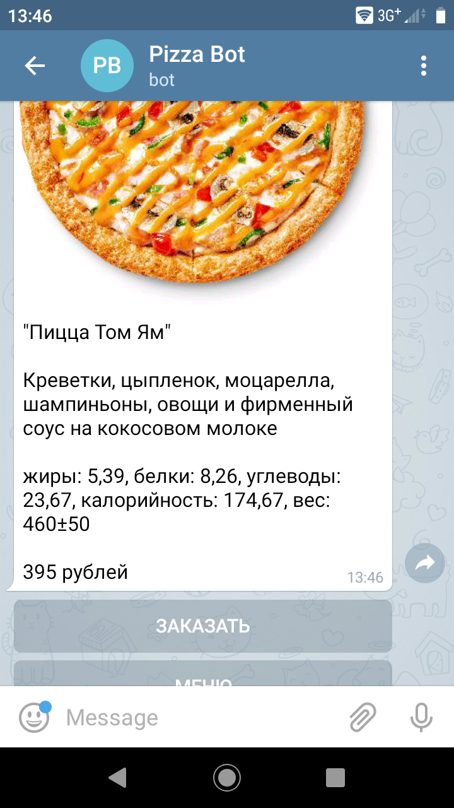

## Pizza Bot

This telegram bot is simple e-shop based on [Moltin API](https://moltin.com) and uses [state machine](https://en.wikipedia.org/wiki/Finite-state_machine) principles. Moltin CSM stores products, user cart and info. [Redis](https://redislabs.com/) DB stores current user statement.


## How to install

1. Python 3 and libraries from **requirements.txt** should be installed. Use virtual environment tool, for example **virtualenv**

```bash
virtualenv virtualenv_folder_name
source virtualenv_folder_name/bin/activate
python3 -m pip install -r requirements.txt
```


2. Create [Moltin account](https://dashboard.moltin.com) and get Moltin Client ID and Client secret. Put these parameters to **.env** file. Add your currency https://dashboard.moltin.com/app/settings/currencies

```bash
MOLTIN_CLIENT_ID=moltin_client_id
MOLTIN_CLIENT_SECRET=moltin_client_secret
```


3. For menu export you should have json file like this:
```javascript
[{
	"id": id,
	"name": name,
	"description": description,
	"food_value": {
		"fats": fats,
		"proteins": proteins,
		"carbohydrates": carbohydrates,
		"kiloCalories": kiloCalories,
		"weight": weight
	},
	"culture_name": "ru-RU",
	"product_image": {
		"url": img_url,
		"height": img_height,
		"width": img_width
	},
	"price": price
},
]
```

save this file on the URL_MENU and add **.env** with the parameter
```bash
URL_MENU=url_with_menu_json
```
Set the width of small image with WIDTH_SMALL constant and run **export_menu.py**. Then the process is finished, check your products [here](https://dashboard.moltin.com/app/catalogue/products). Also you'll got original and resized images in the IMAGES_DIR folder.


4. For addresses export you should have json file like this:
```javascript
[{
	"id": id,
	"alias": address_alias,
	"address": {
		"full": full_address,
		"city": city,
		"street": street,
		"street_type": street_type,
		"building": building
	},
	"coordinates": {
		"lat": latitude,
		"lon": longitude
	}
},
]
```

save this file on the URL_ADDRESSES and add it in the **.env**
```bash
URL_ADDRESSES=url_with_addresses_json
```

Set MOLTIN_FLOW_ADDRESSES constant in the **common.py**. This is the name of your flow with addresses. Then set FLOW_FIELDS constant in the **export_addresses.py**, MOLTIN_FLOW_ADDRESSES_ID ennviroment variable in the **.env**, run the file **export_addresses.py** and check FLOWS section on [your dashboard](https://dashboard.moltin.com/)


4. To create customers flow set MOLTIN_FLOW_CUSTOMERS constant in the **common.py**. This is the name of your flow with customers. Then set FLOW_FIELDS constant in the **create_customers.py**, MOLTIN_FLOW_CUSTOMERS_ID ennviroment variable in the **.env**, run the file **create_customers.py** and check FLOWS section on [your dashboard](https://dashboard.moltin.com/)


5. Create new Telegram bot, get token and your ID.

6. Create Redis account, get host, port and password.

7. Update **.env** file.

```bash
TELEGRAM_TOKEN=telegram_telegram
TELEGRAM_CHAT_ID_ADMIN=telegram_chat_id_admin
REDIS_HOST=redis_host
REDIS_PORT=redis_port
REDIS_PWD=redis_pwd

```


## Quickstart

Run **main.py** and test your e-shop in Telegram.




## How to deploy

For example, you can deploy apps on [Heroku](https://heroku.com), with
GitHub integration.

1. Create app with GitHub deployment method.

2. Add vulnerable environment variables to Settings > Config Vars section.

3. Activate your Dyno in the "Resourses" section.

For reading logs install [Heroku CLI](https://devcenter.heroku.com/articles/heroku-cli#download-and-install) and log in.

```bash
$ heroku logs -a your-app-name
```


## Project Goals

The code is written for educational purposes on online-course for
web-developers [dvmn.org](https://dvmn.org/).
